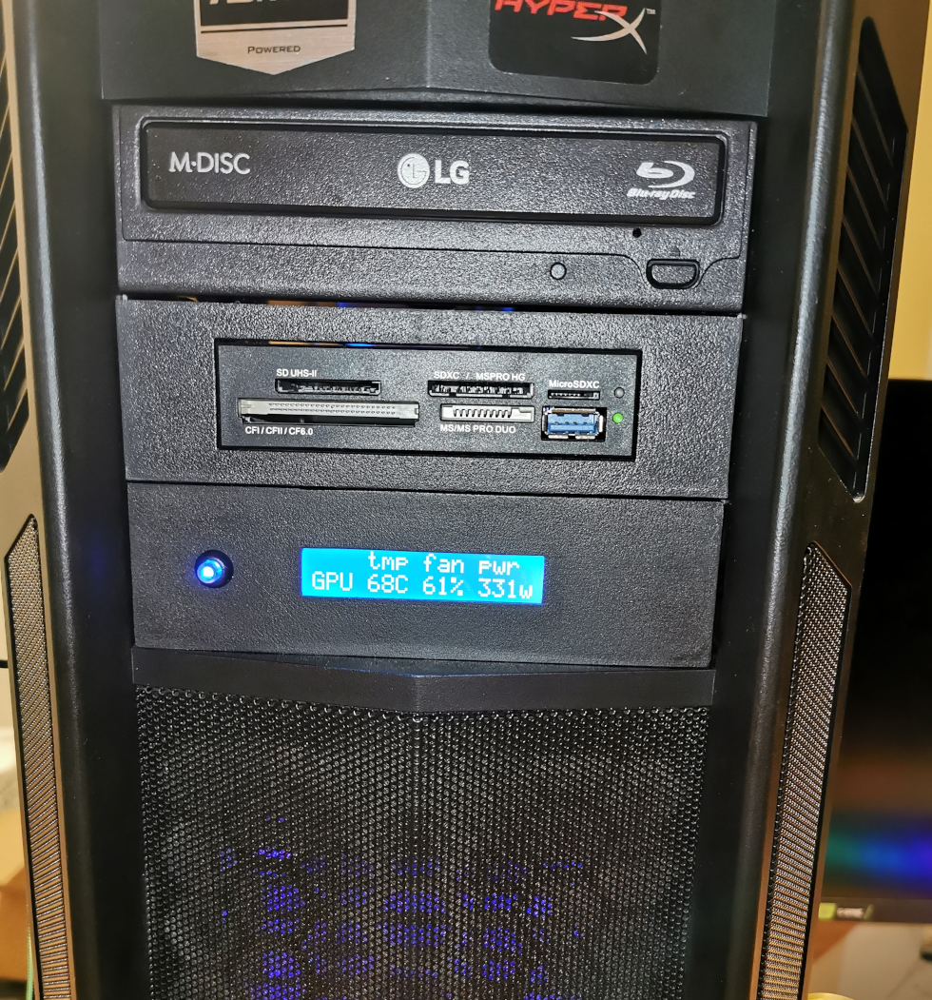

# Sensor display monitor
This is a complete project to display temperature, fan speed and power consumption to a small 2x20 LCD display. The head unit fits a 5.25 standard PC drive bay.

## Features
Head unit:
- Arduino based
- 6 modes of operation
- Enclosure printable without supports

SystemD service (PC):
- Fully customizable using a configuration file
- Installation script included
- Written in Python
- Linux Support

## What's included
- Bill of material
- 3D Models (Step, Solidwork and STL)
- Electrical schematic
- Source code for the head unit (Arduino based)
- Source code for the service that monitor and send the data to the head unit
- VSCode devcontainer environment for the service and the head unit
- Some pictures of the final product

## Licenses
[Mechanical parts](MECHA/COPYING.TXT)  
[Head unit (Arduino)](SOFT/Arduino/COPYING.TXT)  
[SystemD Service (PC)](SOFT/PC/COPYING.TXT)  

